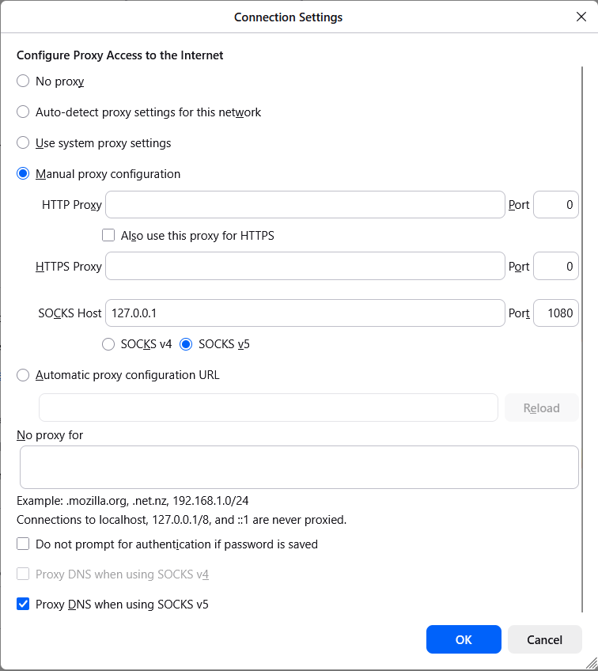
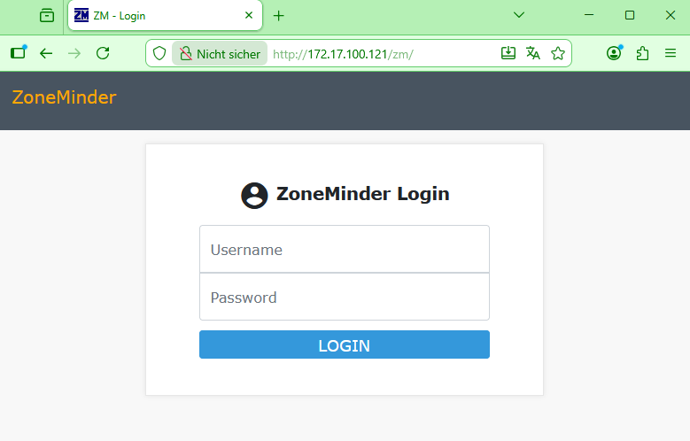

=========================
Connecting to Virtual Machines
=========================

All virtual machines in the attackbed are deployed on OpenStack/OVH and are not directly reachable
from the internet. Access is facilitated through a dedicated **management host** (``mgmt``), which
has *network interfaces in all attackbed networks* and is the only machine with a public IP address. 
(This is the floating IP you have allocated to the OpenStack/OVH project previously and named ``mgmt``, 
which can then be used by terraform on deployment.)
The management host serves as a jump host for all other machines.

All machines are configured with the **testbed key** during deployment, and the Linux user is
always ``aecid``.

Direct Access to the Management Host
=====================================

::

  ssh -i <testbed-key> aecid@<mgmt-ip>

Accessing Other Machines via Jump Host
=======================================

To reach any other machine directly from your local system, use the ``-J`` (ProxyJump) flag:

::

  ssh -i <testbed-key> -J aecid@<mgmt-ip> aecid@<target-ip>

For example, to connect to the ``attacker`` machine:

::

  ssh -i <testbed-key> -J aecid@<mgmt-ip> aecid@192.42.1.174

SSH Config for Convenient Access
==================================

To avoid typing jump host arguments every time, add the following block to your ``~/.ssh/config``.
Replace ``<mgmt-ip>`` and ``<testbed-key>`` with the actual values for your project (see
replacement commands below).

::

  Host mgmt
    HostName <mgmt-ip>
    User aecid
    IdentityFile <testbed-key>
    StrictHostKeyChecking no
    UserKnownHostsFile /dev/null

  Host attacker
    HostName 192.42.1.174
    User aecid
    IdentityFile <testbed-key>
    ProxyJump mgmt
    StrictHostKeyChecking no
    UserKnownHostsFile /dev/null

  Host lanturtle
    HostName 192.168.100.27
    User aecid
    IdentityFile <testbed-key>
    ProxyJump mgmt
    StrictHostKeyChecking no
    UserKnownHostsFile /dev/null

  Host reposerver
    HostName 172.17.100.122
    User aecid
    IdentityFile <testbed-key>
    ProxyJump mgmt
    StrictHostKeyChecking no
    UserKnownHostsFile /dev/null

  # used in videoserver scenario
  Host adminpc1
    HostName 10.12.0.222
    User aecid
    IdentityFile <testbed-key>
    ProxyJump mgmt
    StrictHostKeyChecking no
    UserKnownHostsFile /dev/null

  # used in lateral movement scenario
  Host adminpc2
    HostName 10.12.0.223
    User aecid
    IdentityFile <testbed-key>
    ProxyJump mgmt
    StrictHostKeyChecking no
    UserKnownHostsFile /dev/null

  Host inetfw
    HostName 172.17.100.254
    User aecid
    IdentityFile <testbed-key>
    ProxyJump mgmt
    StrictHostKeyChecking no
    UserKnownHostsFile /dev/null

  Host inetdns
    HostName 192.42.2.2
    User aecid
    IdentityFile <testbed-key>
    ProxyJump mgmt
    StrictHostKeyChecking no
    UserKnownHostsFile /dev/null

  Host client
    HostName 192.168.50.100
    User aecid
    IdentityFile <testbed-key>
    ProxyJump mgmt
    StrictHostKeyChecking no
    UserKnownHostsFile /dev/null

  Host linuxshare
    HostName 192.168.100.23
    User aecid
    IdentityFile <testbed-key>
    ProxyJump mgmt
    StrictHostKeyChecking no
    UserKnownHostsFile /dev/null

  Host videoserver
    HostName 172.17.100.121
    User aecid
    IdentityFile <testbed-key>
    ProxyJump mgmt
    StrictHostKeyChecking no
    UserKnownHostsFile /dev/null

  Host corpdns
    HostName 192.42.0.233
    User aecid
    IdentityFile <testbed-key>
    ProxyJump mgmt
    StrictHostKeyChecking no
    UserKnownHostsFile /dev/null

  Host wazuh
    HostName 192.168.100.130
    User aecid
    IdentityFile <testbed-key>
    ProxyJump mgmt
    StrictHostKeyChecking no
    UserKnownHostsFile /dev/null

Replacing Placeholders with Actual Values
------------------------------------------

After copying the config, run the following two commands to substitute the placeholders with the
real management host IP and path to your testbed key:

::

  sed -i 's/<mgmt-ip>/YOUR.MGMT.IP.HERE/g' ~/.ssh/config
  sed -i 's|<testbed-key>|/path/to/your/testbed-key|g' ~/.ssh/config

Replace ``YOUR.MGMT.IP.HERE`` with the actual public IP assigned to ``mgmt`` in your project, and
``/path/to/your/testbed-key`` with the actual path to your private key file (e.g. ``~/.ssh/testbed``).

Usage
------

Once the config is in place, you can connect to any machine by name:

::

  ssh mgmt
  ssh attacker
  ssh wazuh
  

Accessing Web Interfaces via SOCKS Proxy
=========================================

Some machines in the attackbed expose web interfaces that are only reachable within the attackbed
networks. To access these from a local browser without exposing them to the internet, SSH can
be used to create a **SOCKS proxy** tunnel. A SOCKS proxy instructs your browser to route all
its traffic through the SSH connection, making your browser effectively appear to be running
inside the attackbed network.

The following example shows how to access the **ZoneMinder** video surveillance interface on
``videoserver`` (``172.17.100.121``).

Setting up the Tunnel
----------------------

Assuming the SSH config from the previous section is in place, run:

::

  ssh -N -D 127.0.0.1:1080 videoserver

The ``-D`` flag opens a local SOCKS proxy on port ``1080``, and ``-N`` tells SSH not to execute
a remote command; the connection exists solely to forward traffic. The jump through ``mgmt``
happens automatically as configured in ~/.ssh/config.

Configuring Firefox
--------------------

Open Firefox's proxy settings via **Settings → General → Network Settings → Settings...** and
configure it as shown below:

- Select **Manual proxy configuration**
- Leave HTTP Proxy and HTTPS Proxy empty
- Set **SOCKS Host** to ``127.0.0.1`` and **Port** to ``1080``
- Select **SOCKS v5**
- Check **Proxy DNS when using SOCKS v5**

   Firefox connection settings configured to use the SSH SOCKS proxy on localhost port 1080.

Accessing ZoneMinder
---------------------

With the tunnel running and the proxy configured, open the following URL in Firefox:

::

  http://172.17.100.121/zm/

You will be presented with the ZoneMinder login interface:

   The ZoneMinder web interface on the videoserver, accessed through the SOCKS proxy tunnel.