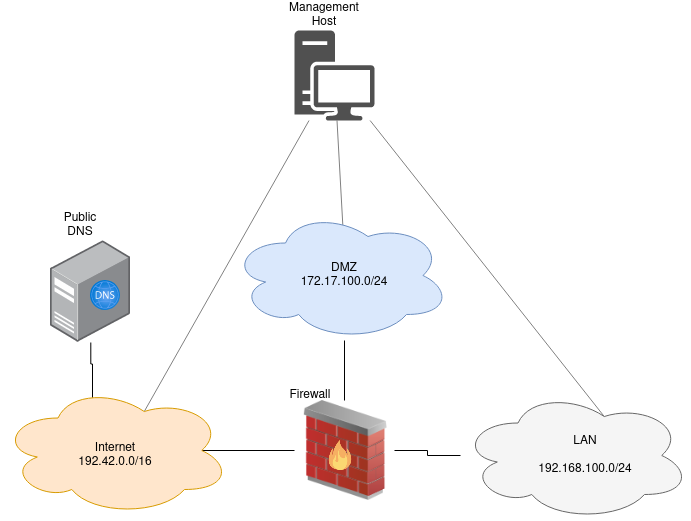

.. _deploy_bootstrap:

================
Deploy bootstrap
================

The bootstrap is a basic network infrastructure with all the network components that are required for all the scenarios. This bootstrap can be deployed with terragrunt.
The terragrunt/bootstrap/terragrunt.hcl stores variables like "image-names":

::

    inputs = {
      host_userdata = "firewallinit.yml"
      ext_router = "aecid-testbed-router"
      sshkey = "testbed-key"
      inetdns_image = "ubuntu-2204"
      inetfw_image = "atb-fw-inet-lan-dmz-image-2023-06-09T14-03-06Z"
      mgmt_image = "ubuntu-2204"
      floating_pool = "provider-aecid-208"
    }

Please do not change the **terragrunt.hcl** directly. To change any variable create a new file with the filename **terraform.tfvars** and change the variables:

::

    ext_router = "myrouter"
    inetfw_image = "atb-fw-inet-lan-dmz-image-2023-06-09T14-03-06Z"
    sshkey = "my-ssh-key"
    floating_pool = "some-floating-pool"

If you built the server images manually you have to change the image-names. It is also necessary to set the **external router** and the **floating_pool**. 
Additionally provide one pre-allocated floating IP with the description "mgmt" (used for the jumphost across deployments). This can be done either in the OpenStack 
Web Interface OR via openstacksdk on the command line:

::

    openstack floating ip create --network <network> --description mgmt
    
After these steps the bootstrap can be deployed:

::

    cd terragrunt/bootstrap
    terragrunt apply

Most of the scenarios require a virtual machine for the **Attacker**. It is also necessary to modify the configuration for the attacker in *terragrunt/attacker/terragrunt.hcl* and
deploy the attacker:

::

    cd terragrunt/attacker
    terragrunt apply
