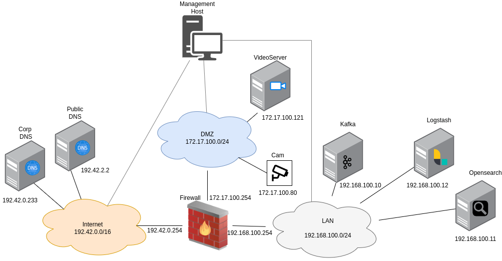

.. _deploy_logpipeline:

=======================
Deploy log pipeline
=======================

The log pipeline consists of several integrated tools that collect, process, and store logs from various components of
the AttackBed infrastructure. The pipeline enables aggregation and retrieval of logs for analysis.

.. note::

   The usage of the log pipeline is optional to collect additional real-time log data.
   However, the scenarios can be run without the setup of the log pipeline.

Architecture
============

1. Filebeat:

   * Collects logs locally from individual hosts and forwards them to Kafka.
   * Pre-installed but disabled by default on the VideoServer, Firewall, and Corp DNS.

2. Kafka:

   * Acts as a message broker, receiving logs from Filebeat.
   * Makes sure that logs are available for processing even under high load.

3. Logstash:

   * Consumes logs from Kafka.
   * Transforms the raw logs into structured data and prepares them for indexing.

4. OpenSearch:

   * Stores processed logs for querying and visualization.

Configuration
=============

To enable the components to communicate with each other, it's important to configure them properly.
These configurations can be set in each of their corresponding ansible role when building the images with packer.

.. note::

   These settings are pre-configured in the `AttackBed <https://github.com/ait-testbed/attackbed>`_, and should
   work out of the box after the steps in the :ref:`deployment-section` section.
   The purpose of this section is to give information about how the tools are integrated together.

Filebeat
--------

Filebeat is pre-installed on the VideoServer, Firewall, and Corp DNS packer images.
However, the **Filebeat service is disabled by default** in the provided playbooks.
To enable the Filebeat service so that it starts automatically on system boot,
you need to update the ``filebeat_service_enabled`` variable to ``true`` in the playbook:

::

  - role: filebeat
    vars:
      filebeat_service_enabled: true

Kafka
-----

In the kafka role, the ``kafka_auto_create_topics`` is set to ``true`` by default.
This means, we don't have to separately create a listener, but any of the following scenarios
can trigger the automatic creation of a topic:

- A producer sends a message to a topic that does not yet exist.
- A consumer attempts to consume from a topic that does not yet exist.

**Manual inspection:**
To check that kafka is getting the logs from filebeat, we can ssh into the kafka machine using the jump host:

::

  ssh -J aecid@<your_mgmt_ip> ubuntu@192.168.100.10

And start a listener to see if the logs are coming in:

::

  cd /usr/local/kafka
  bin/kafka-console-consumer.sh --bootstrap-server localhost:9092 --consumer.config config/consumer.properties --topic logs

Logstash
--------

**Input Configuration:**
Logstash must be configured to consume logs from Kafka. This is done when building the image with packer,
by setting the following role variable:

::

  - role: logstash
    vars:
      logstash_kafka_topics: [ "logs" ]

**Output Configuration**:
Logs are then sent to OpenSearch. The output configuration is defined in the role's ``templates/31-opensearch-output.conf.j2`` file.

OpenSearch
----------

The Opensearch Dashboard is hosted inside the AttackBed infrastructure. This means, to access the dashboard locally,
we have to use port forwarding via our jump host. Open a terminal and run the following:

::

  ssh -D 9999 aecid@<your_mgmt_ip>

Next, open a browser and in the settings enable a SOCKS Host proxy on port ``9999``. Now the Dashboard is available
under `http://192.168.100.11:5601 <http://192.168.100.11:5601>`_. Default login credentials are:

- Username: ``kibanaserver``
- Password: ``Test@6789``

.. _deployment-section:
Deployment
==========

After building the images with packer, create a ``terraform.tfvars`` file in the ``terragrunt/logging`` folder
with the following variables:

::

    sshkey = "your-ssh-key"
    opensearch_image = "your-opensearch-image"
    kafka_image = "your-kafka-image"
    logstash_image= "your-logstash-image"

After these steps the log pipeline can be deployed:

::

    cd terragrunt/logging
    terragrunt apply
