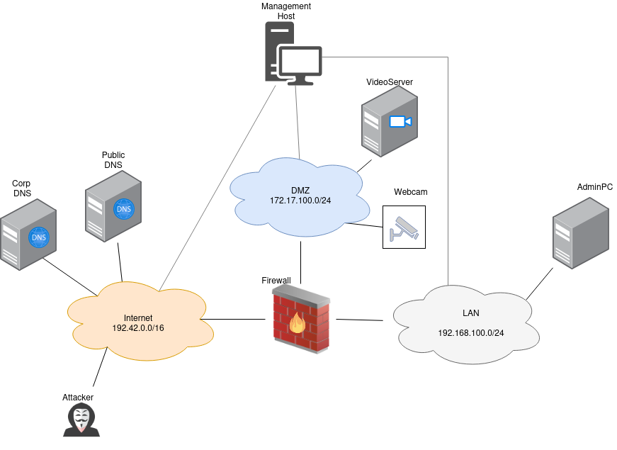

.. _deploy_scenario:

===============
Deploy scenario
===============

A scenario can be installed similar to the bootstrap(see: :ref:`deploy_bootstrap`). The following steps are required:

1. Change into the directory(e.g. *terragrunt/videoserver*)
2. Modify terragrunt.hcl
3. Run **terragrunt apply**

