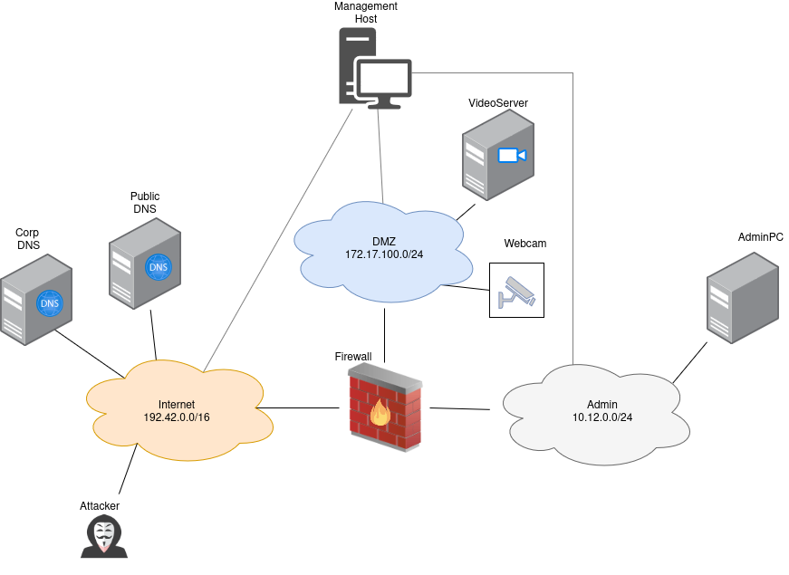

.. _deploy_scenario:

===============
Deploy scenario
===============

.. seealso:: :ref:`deploy_bootstrap`

A scenario can be installed similar to the bootstrap. The following steps are required:

1. Change into the directory(e.g. *terragrunt/videoserver*)
2. Copy and modify terraform.tfvars.example to terraform.tfvars
3. Run **terragrunt apply**

