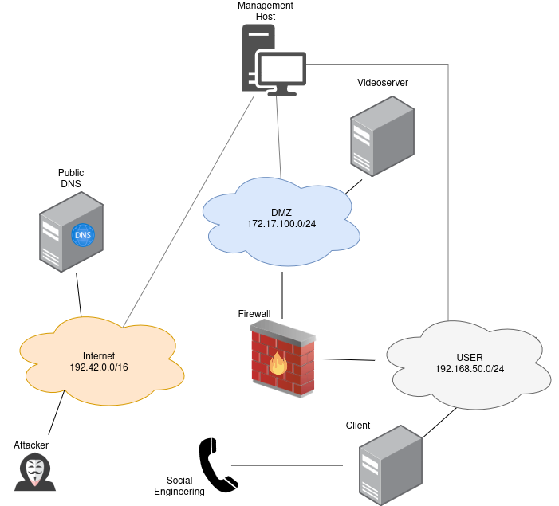

=======================
Client (Scenario 6)
=======================

Attacker Steps:
---------------

1. Client gets exploited

   a. Opening Open Office Document with malicious Macro (T1204)
   b. Installing screen sharing software (T1219)

2. Attacker persists using icmp-malware(T1095)
   a. by swapping binary of browser in $HOME(T1554)(T1546)
   b. by installing cronjob as user(T1053)

Alternatively:
1. Client gets exploited

   c. Installs malicious browser plugin (T1176)(T1203)

2. Plugin sends keystrokes to attacker (T1056.001)
3. Plugin sends formdata to attacker (T1056.004)
4. Plugin sends clipboard data to attacker (T1115)

 
