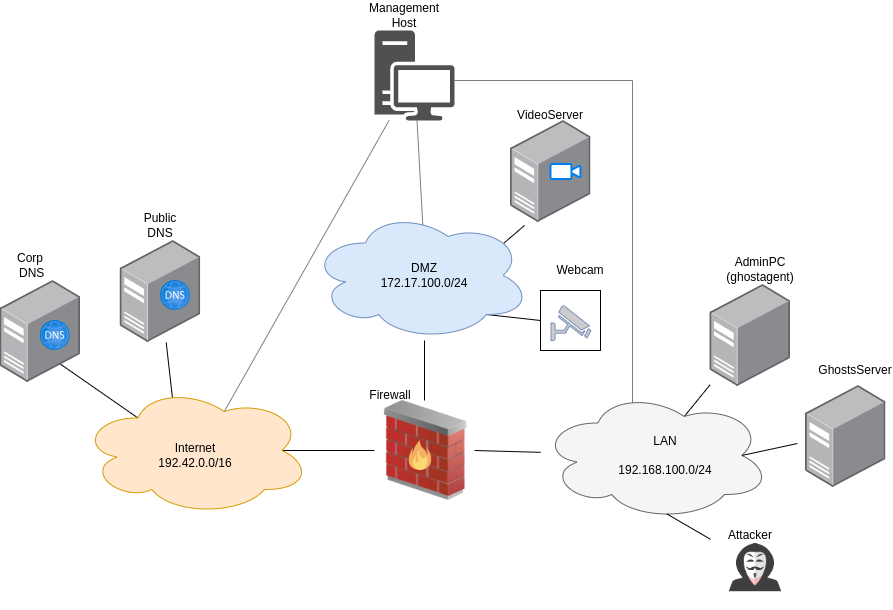

=============================
LAN Turtle (Scenario 5)
=============================

Attacker Steps:
---------------

1. Attacker joins the network with a new machine (Lanturtle) (T1200)
2. Attacker executes arp-spoofing against client + firewall (T1557)
3. Clients connects via http to server in dmz
4. Attacker performs sslstrip-attack and gains cookie
5. Attacker uses cookie to login (T1563)

Manual Walkthrough
==================

All steps of the scenario can be executed automatically as an ansible playbook.
However for a manual inspection, the detailed steps are described below.

\1. Attacker joins the network with a new machine (Lanturtle) (T1200)

This step is part of the initial setup, an attacker machine is already placed inside
the LAN network with terragrunt.

\2. Attacker executes arp-spoofing against client + firewall (T1557)

For this step, bettercap is used. There is a ``ansible/run/scenario5/files/bettercap.cap`` file defined with the target IP of the AdminPC:

::

  net.probe on
  set arp.spoof.targets 192.168.100.222
  arp.spoof on
  set http.proxy.sslstrip true
  http.proxy on

To manually start the APR spoofing, run ``sudo bettercap -caplet bettercap.cap``.

\3. Clients connects via http to server in dmz

This step is automated with the ghostagent. The timeline.json file is responsible for defining the actions.
With the option ``"isheadless": "true"``, we can just connect to the AdminPC via a terminal and run:

::

  cd ghosts-client-linux-v8.0.0
  ./ghosts.client.linux

If we want to use ``"isheadless": "false"``, there is noVNC installed on the AdminPC. To connect to the machine
via the browser, first we have to have a terminal open for tunneling:

::

  ssh -D 9999 aecid@<MGMT_IP>

And in the settings of the local browser, set a manual proxy on port 9999 (found in the network settings.)

Note: if the process is ran automatically via the ansible playbook, but interrupted,
it could happend that the ghostagent is not stopped. To inspect if there is a ghostagent process running,
we can use:

::

  pgrep -fl ghosts.client.linux

To kill the process, run:

::

  sudo kill <PROCESS_ID>

We can observe it on the videoserver machine, that requests are really arriving, by inspecting
the following file: ``/var/www/default/log/access.log``.

\4. Attacker performs sslstrip-attack and gains cookie

The process for this is defined in the ``ansible/run/scenario5/files/get_cookie.py`` file.

\5. Attacker uses cookie to login (T1563)

Attackmate is utilized to recreate the http request, passing the stolen session ID
along with the cookies (see ``ansible/run/scenario5/files/playbook.yml``).

