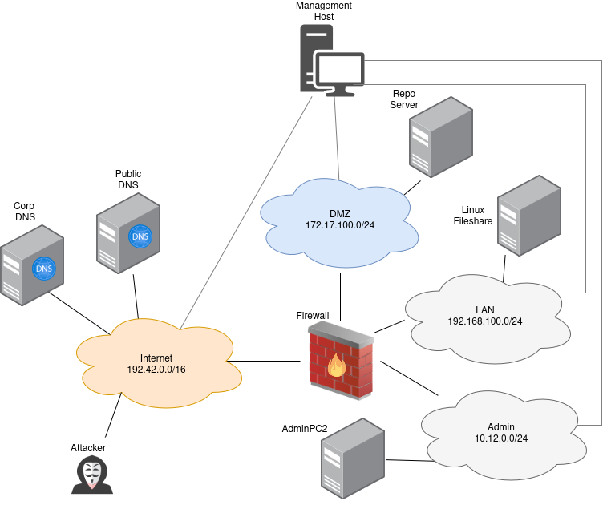

=============================
Lateral Movement (Scenario 3)
=============================

Attacker Steps:
---------------

1. Attacker brute-forces (T1078, T1133, T1110):

   a) ssh
   b) vnc

2. Attacker sniffs for credentials (server automatically logs into ftp) (T1040)
3. Pivilege Escalation via password reuse from point 3(T1078)
4. Attacker dumps password from /etc/shadow(T1003) which can be reused on other server
5. Attacker reads data from puppet-repository(T1213)
6. Attacker reads out information from other server network share(T1039)
7. Attacker runs nmap, ping, nmb-scan against other server(T1018, 1046)
8. Lateral Movement via

   a) share: attacker replaces installation file that is used by another server(T1080)
   b) exploit: attacker exploits a vulnerable service on another server(T1210)
   c) apt: attacker replaces debian repository files which gets installed by another server(T1072)
   d) puppet: attacker deploys backdoor via puppet(T1072)

On other host: (T1499)

1. remove account(T1531)
2. delete data (T1485 from share-folder)
3. encrypt data using ransomware(T1486, T1565)
4. Delete Backupfiles(T1490)
5. Stop Service(T1489)

