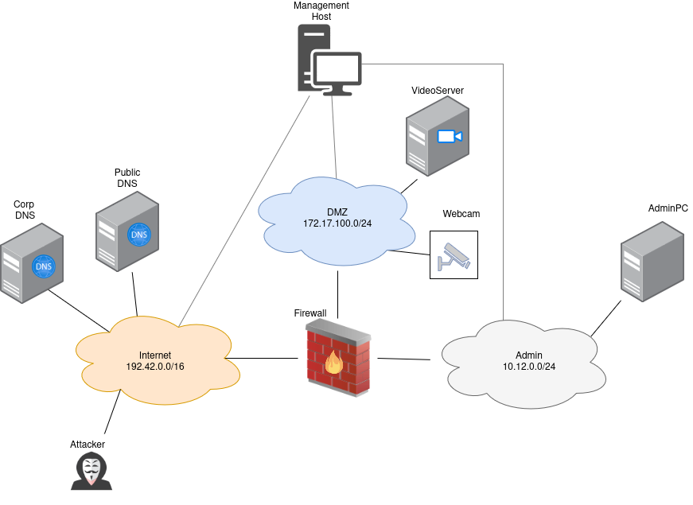

=========================
Linux Malware (Scenario 2)
=========================

The Linux Malware scenario uses the same infrastructure as the videoserver-scenario:

Attacker Steps:
---------------

1. Malware is installed and persisted:

   a) sliver is installed via systemd(T1569, T1547, T1037)
   b) sliver is executed via cronjob(T1053)
   
2. Malware executes commands (T1106, T1622, T1140)
3. Malware exfiltrates data(/etc/shadow) (T1071,T1132,T1001,T1573,T1572, T1041, T1048, T1030, T1020)
4. Malware uses a tar-archiv(T1560, T1074,T1005)
5. Malware discovers password policy(T1201)
6. Malware uploads nmap(T1105)
7. Malware executes nmap (T1046, T1018)
8. Attacker installs LD\_PRELOAD Rootkit(T1014, T1564, T1574)
9. Attacker uses rootkit to gain root-privileges (T1574)
10. Attacker hides process via rootkit(T1014)
11. Hidden rootuser runs find against suid files(T1083)
12. Hidden rootuser discovers group-files(T1069)
13. Hidden rootuser runs nmap(T1046, T1018)
14. Hidden rootuser discovers password policy(T1201)

