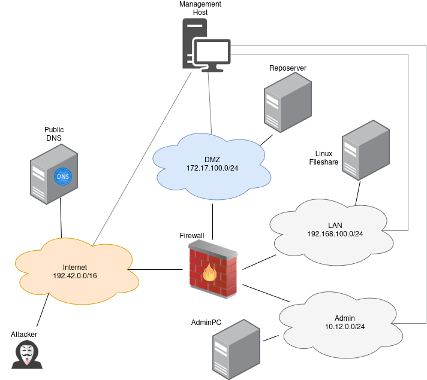

======================
Network (Scenario 4)
======================

Attacker Steps:
---------------

1. Attacker is already on machine in DMZ (reposerver)
2. Attacker gets access on firewall via ssh that is open in DMZ via user and password reuse from step 1
3. Attacker installs malware that uses portknocking (T1205) on firewall
4. Knock sequence triggers a script that downloads and executes sliver malware
5. Attacker connects via sliver malware (T1205)
6. Attacker modifies iptables so that DMZ host is allowed to connect to a server in the lan (T1599)
7. Attacker connects to the linux fileshare server in the lan via the DMZ host, user and password reuse from step 1
